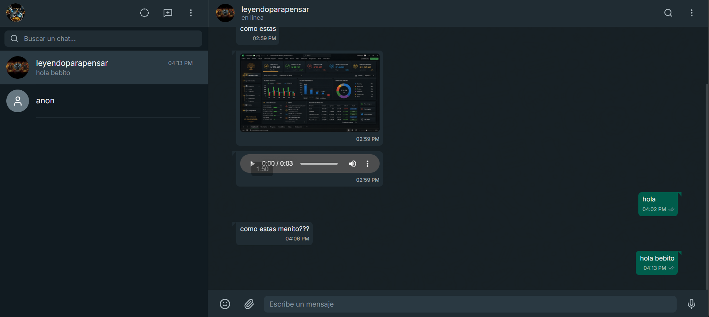

# WhatsApp Clone

Este proyecto es un clon funcional de WhatsApp Web, construido con **Next.js**, **React** y **Vanilla CSS** para el frontend, y **InsForge** como backend todo en uno (Base de datos, Autenticación, Almacenamiento y Tiempo Real).

## Características Principales
- **Autenticación Segura**: Login con Google y Email protegido por InsForge Auth.
- **Mensajería en Tiempo Real**: Envío y recepción de mensajes al instante (con audios y archivos).
- **Estados Efímeros**: Sube fotos a tu estado; desaparecen automáticamente tras 24 horas y cuentan con la animación clásica de la barra de progreso.
- **Buscador de Contactos**: Encuentra y agrega a otros usuarios registrados en la plataforma.
- **Diseño Responsivo**: Interfaz fluida y optimizada idéntica a la experiencia original.

## Seguridad
- Las credenciales sensibles (`.env.local`) y la configuración del proyecto se mantienen excluidas del control de versiones.
- Las tablas en base de datos cuentan con políticas de seguridad **RLS (Row Level Security)**, asegurando que solo los participantes de un chat puedan leer e insertar mensajes, y garantizando la privacidad de los estados.

## Tecnologías Utilizadas
- **Frontend**: Next.js, React, Vanilla CSS.
- **Backend / BaaS**: InsForge (PostgreSQL, Storage, Auth).
- **Despliegue**: InsForge Deploy (Vercel).

## Visualizar el Proyecto
Puedes interactuar con el proyecto en vivo visitando el siguiente enlace:
🔗 [WhatsApp Web Clone en Vivo](https://9yhgh43d.insforge.site)
